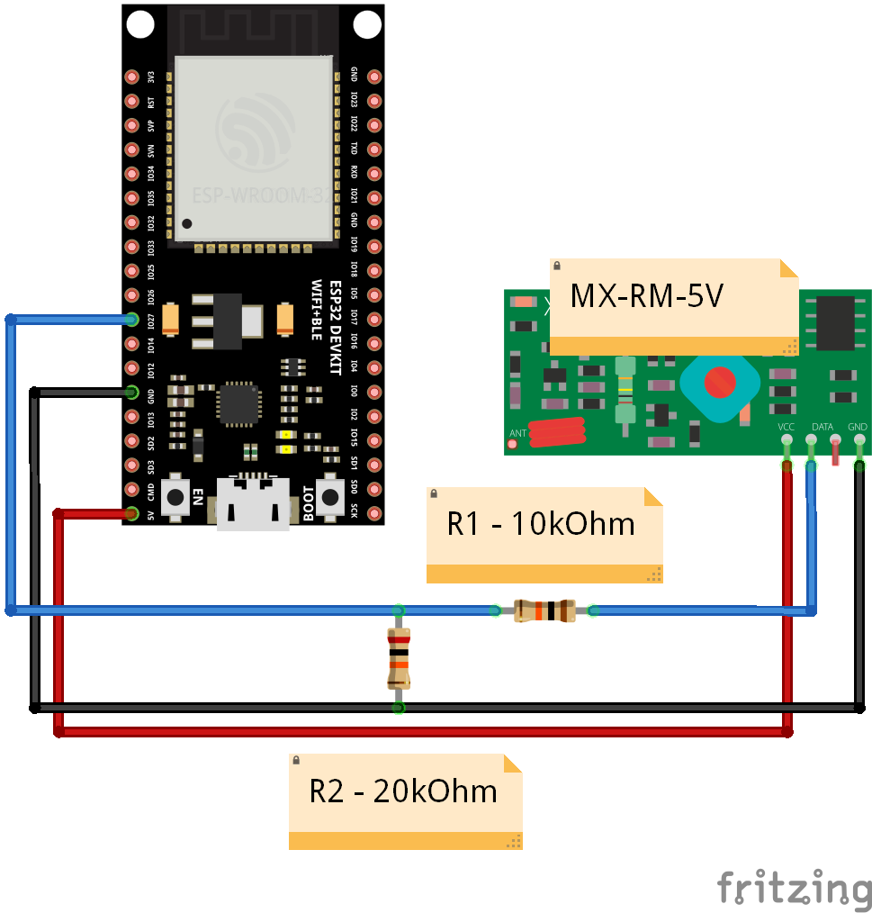

# ESP32 RF433 Sniffer

## Introduction

This is a DIY project to play and learn how 433MHz signals and related protocols work. For example,
you can read a signal from your remote to replicate or clone it...

It supports:

- "Old style" remote protocols (SC5262 / SC5272 / HX2262 / HX2272 / PT2262 / PT2272 / EV1527 / etc...) with the [RCSwitch](https://github.com/sui77/rc-switch) library
- "New style" remote protocols (HomeEasy, Chacon, KaKu, Intertechno, etc...) with the [NewRemoteSwitch](https://github.com/1technophile/NewRemoteSwitch) library

> ⚠️ **Important note**: the **MX-RM-5V** module used in this project is very cheap and extremely sensitive to noise and interference.
> Its range is very short, so it is not designed for complex or professional usage.

## Requirements

Hardware:

- ESP32 (i'm using ESP32-WROOM-32)
- 433MHz receiver (MX-RM-5V module)
- 433MHz emitter (FS1000A module) - [Optional] *only if you want to emit signals*

Software:

- Arduino IDE
- PuTTY

## Hardware

WIP

Here is the electronic schema below:

## Software

We will use the [Arduino IDE](https://docs.arduino.cc/software/ide/) (v2.3.6) to compile and upload program to the **ESP32 board**.

You can use other tool like [PlatformIO](https://platformio.org/), but this documentation **only covers Arduino IDE usage**.

### Arduino IDE setup

> 💡 **Note**: you can also follow [this tutorial](https://randomnerdtutorials.com/installing-the-esp32-board-in-arduino-ide-windows-instructions/) at *randomnerdtutorials.com*.

First, you need to install the **ESP32 board** in the IDE:

- go to **File** > **Preferences**
- enter the following URL into the **Additional Board Manager URLs** field:

  `https://espressif.github.io/arduino-esp32/package_esp32_index.json`

- then, open the Boards Manager by going to **Tools** > **Board** > **Boards Manager**
- search for `esp32` and press install button for the **"esp32 by Espressif Systems"**

Then, you need to install the [RCSwitch](https://github.com/sui77/rc-switch) and [NewRemoteSwitch](https://github.com/1technophile/NewRemoteSwitch) libraries:

- go to **Tools** > **Manage libraries**
- search for `rc-switch` and press install button for the **"rc-switch by sui77"**
- as the **NewRemoteSwitch** library requires manual installation, you can either:
  - include the library from `.zip` archive by following the [Arduino documentation instructions](https://docs.arduino.cc/software/ide-v1/tutorials/installing-libraries/#importing-a-zip-library)
  - or copy the `software/ESP32-RF433-Sniffer/libraries/NewRemoteSwitch` folder of this repository into the Arduino IDE sketchbook location folder (go to **File** > **Preferences** under **Sketchbook location** to know where it is located in your file system)

### Compile and upload

Plug your ESP32 to your computer via USB.

> ⚠️ You may need to install a [CP210x USB to UART Bridge VCP Driver](https://www.silabs.com/software-and-tools/usb-to-uart-bridge-vcp-drivers)

In the Arduino IDE:

- select the COM port in **Tools** > **Port:** menu
- select your board in **Tools** > **Board** menu (in my case it's the ESP32 Dev Module)
- go to **File** > **Open** and select the `software/ESP32-RF433-Sniffer/ESP32-RF433-Sniffer.ino` file

You can now upload the program to your ESP32.

> 💡 **Note**: you may need to press the "BOOT" button on your ESP32 board when connecting to start uploading

Once the program is uploaded, you can start to play with your sniffer! 😎. See below how to use it.

## Usage

Your sniffer is now ready to be used. You will need a tool like [PuTTY](https://putty.org/index.html) installed on your computer to
communicate with.

Once your sniffer is plugged to your computer, open PuTTY and set the following values in the **Session** section:

- Serial line: `COMX` (replace `X` by your number)
- Speed: `115200`
- Connection type : "Serial"

Then, in the **Terminal** section:

- enable "Implicit LF in every CR"
- Local echo must be "Force on"
- Local line editing must be "Force on"

> 💡 **Note**: you can save the session to re-use later.

Enjoy! 😉

## Credits

Thanks to:

- [Suat Özgür](https://github.com/sui77) for the [RCSwitch](https://github.com/sui77/rc-switch) library (v2.6.4)
- [Florian Robert](https://github.com/1technophile) & [Randy Simons](http://randysimons.nl/) for the [NewRemoteSwitch](https://github.com/1technophile/NewRemoteSwitch) library (v1.2.0)
