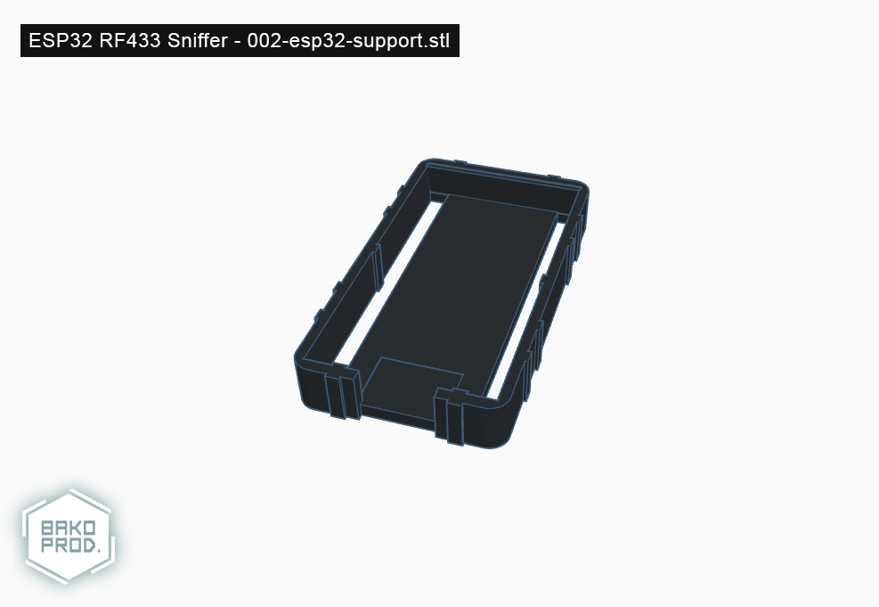

# 002-esp32-support (ESP32 RF433 Sniffer - ESP32 support)

## Informations

**Version**: `1.0`

**Reference**: `002-esp32-support`

**Name**: `ESP32 support`

## Printing details

|Infill   |Supports         |Rafts            |Resolution   |Filament        |
|-        |-                |-                |-            |-               |
|17%      |Doesn't matter   |Doesn't matter   |0.20mm       |Doesn't matter  |

## Images

