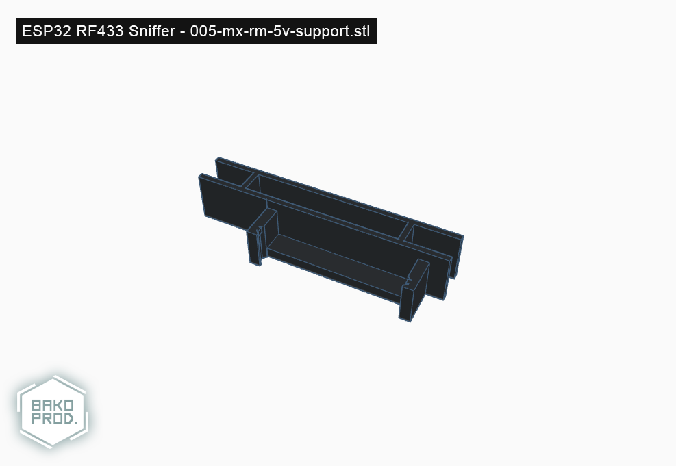

# 005-mx-rm-5v-support (ESP32 RF433 Sniffer - MX-RM-5V support)

## Informations

**Version**: `1.0`

**Reference**: `005-mx-rm-5v-support`

**Name**: `MX-RM-5V support`

## Printing details

|Infill   |Supports         |Rafts            |Resolution   |Filament        |
|-        |-                |-                |-            |-               |
|17%      |Doesn't matter   |Doesn't matter   |0.20mm       |Doesn't matter  |

## Images

