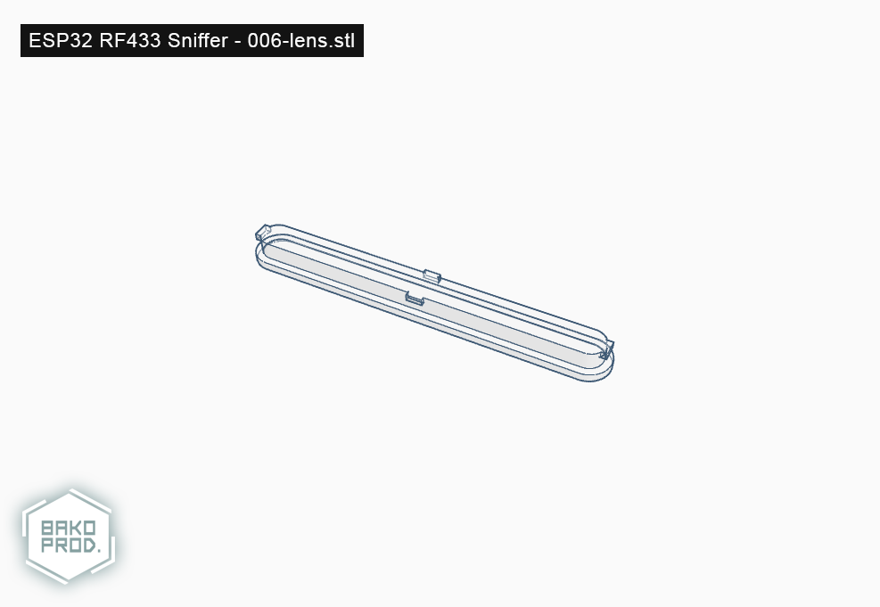

# 006-lens (ESP32 RF433 Sniffer - Lens)

## Informations

**Version**: `1.0`

**Reference**: `006-lens`

**Name**: `Lens`

## Printing details

|Infill   |Supports         |Rafts            |Resolution   |Filament        |
|-        |-                |-                |-            |-               |
|100%     |Doesn't matter   |Doesn't matter   |0.20mm       |Transparent     |

## Images

